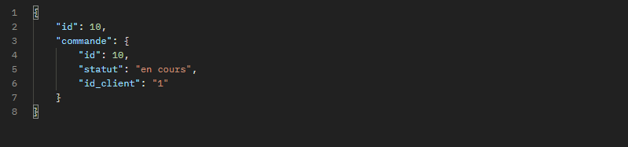

Commande disponible : 

PRODUIT

/products --> Retourne tout les produits

/products/{id} --> Retourne le produit avec l'id

/products?name={valeur} --> Retourne le produit et les options possible

/products?categories={id} --> Retourne tout les produits d'une catégorie (ID donnée)

CATEGORIES

/categories --> Retourne toutes les catégories

/categories/{id} --> Retourne une catégories avec l'id 

Cookie : Pannier /

// Test the functions

addTopanier($id_produit, $nom, $prix, $quantite) -> permet de rajouter un element dans panier
removeFromPanier($id_produit) -> permet d'enlever un 
clearpanier() --> permet de vider entièrement le panier 

addTopanier(1, Robe, 35, 2); // Ajoute deux unité du produit avec ID 1 
addTopanier(2, 1); // Ajoute une unité du produit avec ID 2 
removeFrompanier(1); // Enlève les produit du panier 

Commande pour inserer un utilisateur : https://mmi.unilim.fr/~bounissou1/SAE301/api/users/signup?prenom=Bastien&nom=Guitard&email=mail@mail&password=mdp

COMMENT INSER UNE COMMANDE COMPLête !

1ère étape :
Lance la requête suivante : 
https://mmi.unilim.fr/~bounissou1/SAE301/api/commandes/addOrder?statut=en cours&id_client=1

Le requête va initialiser le Bon de commande avec son statut et son id_client --> l'id client sera à prendre de ton local storage
La requête te retourne :
Retour :  --> Tableau
Tableau[0] --> id = id de la commande ! à conservé pour la requête suivante !
Tableau[1] --> les valeurs rajouté 

2ème étape : 
Lance la requête suivante : 
id_commande --> est l'id retournée par la requête précédentes 
price --> prix que de l'article (valeur que prend ton tableau pannier js)
quantity -> quantité de l'article (valeur que tu prend dans ton tableau pannier js)
id_product -> id du produit de l'article (valeur que tu prend)
Commande pour inserer les produits de la commande : https://mmi.unilim.fr/~bounissou1/SAE301/api/commandes/addOrderDetail?id_commande=1&price=1&quantity=1&id_product=1

Voilà

Page du client -->  html à part 
--> l'utilisateur est en localstorage 
https://developer.mozilla.org/fr/docs/Web/API/XMLHttpRequest_API/Using_FormData_Objects